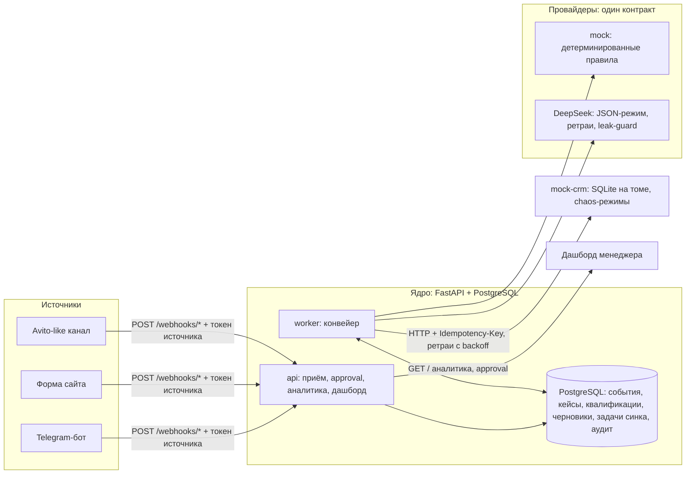

# ATHENAI LEAD RECOVERY & SALES CRM CORE

Локально запускаемый вертикальный срез системы обработки входящих лидов
для вымышленной B2B-компании **AthenAI DemoService**: приём из трёх
источников (Telegram, форма сайта, Avito-like), LLM-квалификация с
детерминированным mock-режимом, безопасные продающие черновики,
human-in-the-loop и идемпотентная запись в локальную mock-CRM.

Диагностическое тестовое задание AthenAI. Все данные синтетические,
рабочих ключей нет, внешние действия выполняются только в симуляции
и только после явного одобрения человека.

## Критерии приёмки — статус

| Критерий | Статус | Чем подтверждается |
|---|---|---|
| Запуск одной командой | ✅ | `docker compose up --build` |
| Миграции и тесты проходят | ✅ | миграции применяются при старте api; `pytest` — 86 passed |
| 100% ответов квалификатора по схеме либо manual_review | ✅ | строгий pydantic-контракт + тесты невалидных ответов |
| ≥ 85% тестовых обращений — ожидаемый маршрут | ✅ | `python -m scripts.verify_routes` — **30/30 (100%)** |
| Нет дублей CRM-сделок | ✅ | идемпотентность по ключу + тесты |
| Нет внешних действий без approval | ✅ | send/simulate только из approved (409 иначе) + тест |
| Нет рабочих секретов и реальных ПД | ✅ | секреты только через env; `.env.example` с безопасными значениями |
| Второй бизнес-профиль без копирования ядра | ✅ | таблица `tenants` + `tenant_id` во всех сущностях |
| Коммерческая записка с проверяемой экономикой | ✅ | [COMMERCIAL_NOTE.md](COMMERCIAL_NOTE.md) |

## Быстрый старт

```bash
docker compose up --build      # единственная команда: db + api + worker + mock-crm
```

| Что | Где |
|---|---|
| Дашборд менеджера | http://localhost:8080/ |
| Swagger API | http://localhost:8080/docs |
| Mock-CRM (+ chaos-режимы) | http://localhost:8081/docs |
| PostgreSQL (для разработки) | localhost:5433, athenai/athenai_dev |

Опционально, на чистой системе:

```bash
docker compose run --rm api python -m scripts.seed           # 30 синтетических лидов
docker compose run --rm api python -m scripts.verify_routes  # отчёт маршрутов (100%)
docker compose run --rm api pytest -q                        # 86 автотестов
docker compose run --rm api ruff check .                     # линтер
```

Ни один внешний ключ не нужен: квалификация по умолчанию —
детерминированный mock. Живой DeepSeek включается переменной
`QUALIFIER_PROVIDER=deepseek` + `DEEPSEEK_API_KEY` (см. `.env.example`).

## Архитектура



Компоненты и их роли:

- **api** — приём вебхуков (валидация, нормализация, дедупликация вставкой),
  approval-эндпоинты, аналитика, статика дашборда. Применяет миграции
  при старте;
- **worker** — фоновый конвейер: новые кейсы → квалификация → черновики
  (guardrails) → идемпотентный CRM-синк с ретраями и dead-letter.
  Параллельные инстансы безопасны (`FOR UPDATE SKIP LOCKED`);
- **mock-crm** — «внешняя» CRM: собственная SQLite-база на томе
  (переживает рестарт), идемпотентность по `Idempotency-Key`,
  chaos-эндпоинты `POST /__chaos/{fail_429|fail_500|timeout|reset}`;
- **db** — PostgreSQL 16, вся консистентность (UNIQUE-дедуп, статусы,
  задачи синка, аудит).

## Поток данных и статусы

Путь обращения (статусная модель задания целиком):

```
new → qualified → draft_ready → awaiting_approval → approved → crm_synced
        │                                            (решение человека)
        ├── manual_review   — мусор модели, guardrail, инъекция, мало данных
        ├── opt_out         — отказ от коммуникации (конвейер не запускается)
        ├── dead_letter     — CRM недоступна после всех ретраев
        └── rejected        — менеджер отклонил черновик
```

Шаги:

1. **Вебхук** (`POST /webhooks/{telegram|website|avito}`, заголовок
   `X-Webhook-Token`). Битый payload → 422 + запись в журнал (`invalid`);
2. **Нормализация** к единой сущности: `external_event_id` выводится
   детерминированно (в т.ч. из содержимого, если источник не прислал);
3. **Дедупликация вставкой**: карточка создаётся INSERT'ом; повтор —
   UNIQUE(tenant_id, external_event_id) отклоняет вставку, событие
   фиксируется как `duplicate`. Гонки исключены по построению;
4. **Opt-out** (флаг согласия или стоп-слова) → статус `opt_out`,
   конвейер к кейсу не применяется;
5. **Квалификация** (worker): провайдер получает только маскированный
   текст без PII, возвращает строгую схему (потребность, срочность,
   бюджет только явный, score 0–100, причины, confidence, manual_review).
   Ответ мимо схемы → `manual_review`;
6. **Черновик** (worker): краткий ответ клиенту + один уточняющий вопрос +
   следующее действие менеджера. Guardrails запрещают цены, скидки,
   сроки, гарантии, наличие — нарушение → `manual_review` (черновик
   сохранён как улика);
7. **Approval** (человек): approve → создаётся задача CRM-синка с ключом
   `deal:<case_id>`; reject → терминальный `rejected`;
8. **CRM-синк** (worker): контакт, сделка (источник, score), черновик,
   задача менеджеру, срок follow-up — одним идемпотентным пакетом.
   Временные сбои (429/5xx/таймаут/нет соединения) → ретраи с
   экспоненциальным backoff и джиттером; исчерпание → `dead_letter`;
9. **Симуляция отправки** — единственная «дверь» к внешнему действию,
   открыта только человеку и только из `approved`.

## API

| Метод и путь | Назначение | Auth |
|---|---|---|
| `POST /webhooks/{telegram\|website\|avito}` | приём события | `X-Webhook-Token` источника |
| `GET /cases` | список кейсов (PII маскированы) | `X-Admin-Token` |
| `GET /cases/{id}` | полная карточка + аудит | `X-Admin-Token` |
| `POST /cases/{id}/approve` | одобрить черновик | `X-Admin-Token` |
| `POST /cases/{id}/reject` | отклонить (терминально) | `X-Admin-Token` |
| `POST /cases/{id}/send/simulate` | симуляция отправки клиенту | `X-Admin-Token` |
| `GET /analytics` | метрики конвейера | `X-Admin-Token` |
| `GET /healthz` | живость | — |

Mock-CRM (порт 8081): `POST /deals` (идемпотентен), `GET /deals`,
`POST /__chaos/{mode}?times=N` — управление отказами для демонстрации.

## Безопасность и модель угроз

| Угроза | Мера |
|---|---|
| Подделка источника (spoofing) | токен на каждый вебхук, сравнение constant-time |
| Prompt injection во входящем тексте | текст — недоверенные данные: разделители `<<<LEAD_TEXT`, запрет в системном промпте, маркеры-детектор в mock, leak-guard цитирования промпта; вывод жёстко ограничен схемой; действий из текста не существует |
| Утечка PII | телефон/e-mail в отдельных колонках; в логи, LLM и API (список/детали) — только маски; полный контакт уходит лишь в CRM (внутренняя система) после одобрения |
| Утечка секретов | только переменные окружения; `.env` в gitignore и dockerignore; ключ API — только в заголовке авторизации (тест проверяет тело запроса) |
| Replay/дубли (tampering) | детерминированный `external_event_id` + UNIQUE в БД; идемпотентность CRM по ключу |
| Ошибка «одно сработало» (reliability) | ретраи с backoff, dead-letter, атомарные транзакции, полный audit_log действий |
| DoS на вебхуки | ограничение размера payload схемой (max_length); полноценный rate-limit — в ограничениях |
| Подмена решения (repudiation) | каждое approve/reject/send пишется в audit_log с актёром и временем |

**Human-in-the-loop**: ни одно сообщение клиенту и ни одно внешнее
действие не выполняется автоматически — только симуляция после явного
approvе. Кейсы с подозрениями (инъекция, guardrail, мусор модели)
маршрутизируются человеку.

## Отказоустойчивость

- классификация ошибок: **временные** (429/5xx/таймаут/сеть → ретраи
  1с→2с→4с…+джиттер, до 5 попыток, затем dead-letter) и **постоянные**
  (4xx → сразу dead-letter);
- «CRM падала и восстановилась» → отложенная задача синкаротится,
  сделка создаётся ровно одна (идемпотентный ключ на всех уровнях);
- «модель ответила мусором» ≠ «API лежит»: первое — кейс человеку,
  второе — кейс повторяется позже;
- работоспособность при параллельных воркерах — SKIP LOCKED.

## Мультиарендность

Все сущности несут `tenant_id`; демо-арендатор `athenai_demoservice`
создаётся миграцией. Второй бизнес-профиль = новая строка `tenants`
(+ маппинг токенов вебхуков на арендатора в реестре источников),
ядро и конвейер не копируются.

## ИИ-провайдеры и расходы

| Режим | Переключение | Расходы |
|---|---|---|
| mock (по умолчанию) | `QUALIFIER_PROVIDER=mock` | 0 ₽, детерминированные маршруты |
| DeepSeek v4-pro | `QUALIFIER_PROVIDER=deepseek` + ключ | см. расчёт ниже |

Расчёт по тарифам DeepSeek (пик: вход $1.32/1M токенов без кэша, выход $3.96/1M;
непик — половина; тарифы проверяемы на странице pricing в API-доках):

- один лид = 2 запроса (квалификация + черновик) ≈ 1600 входных и 300 выходных
  токенов ≈ **$0.003 (~0.3 ₽) за лид**;
- прогон всех 30 сид-лидов в живом режиме обошёлся бы ≈ 10 ₽;
- фактические живые проверки при разработке (2 запроса) ≈ $0.003 — менее 1 копейки;
- бюджетный вариант `v4-flash` ($0.44/1M вх, $1.32/1M вых) — в 3–4 раза дешевле
  при том же контракте провайдера.

Фактическое время работы над проектом и распределение «лично / с ИИ»
описаны в сопроводительном письме к сдаче.

## Ограничения (осознанные)

- Нет реальной отправки сообщений — по требованию задания только
  симуляция после approval; точка расширения — `POST /cases/{id}/send/simulate`;
- Bitrix24/amoCRM не подключены — вместо них mock-CRM с тем же
  контрактом (`app/crm/client.py` — единственное место интеграции);
- Rate-limiting вебхуков и подпись событий (timestamp+signature) —
  следующие шаги для продакшена;
- Mock-CRM хранит данные в SQLite (достаточно для демо-нагрузки);
- Тесты живого LLM не гоняются в CI — провайдер подменяется
  транспортом (MockTransport), реальный API проверялся вручную
  (`scripts/live_deepseek_check.py`).

## Структура репозитория

```
app/
  api/        — вебхуки, кейсы, approval, аналитика, дашборд-статика
  crm/        — клиент CRM (ретраи/backoff) и движок синхронизации
  providers/  — квалификаторы и генераторы черновиков (mock / deepseek)
  worker/     — конвейер
  models.py   — 7 таблиц ядра
  guardrails.py, pii.py, normalize.py, schemas.py, config.py
mock_crm/     — «внешняя» CRM с chaos-режимами
dashboard/    — одностраничный дашборд (без сборки)
migrations/   — Alembic
seed/         — 30 синтетических лидов
scripts/      — seed, verify_routes, live_deepseek_check
tests/        — 86 автотестов
```

## Результаты проверок

- `ruff check .` — ошибок нет;
- `pytest -q` — **86 passed**;
- `python -m scripts.verify_routes` — **30/30 (100%)**, повторные доставки
  распознаны, дублей карточек нет.
